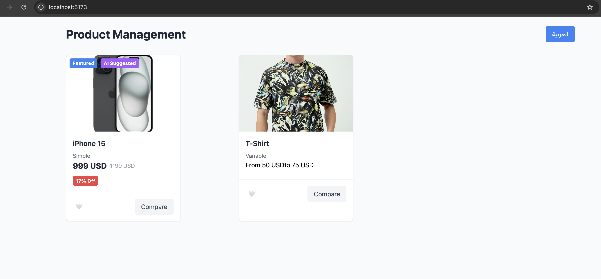
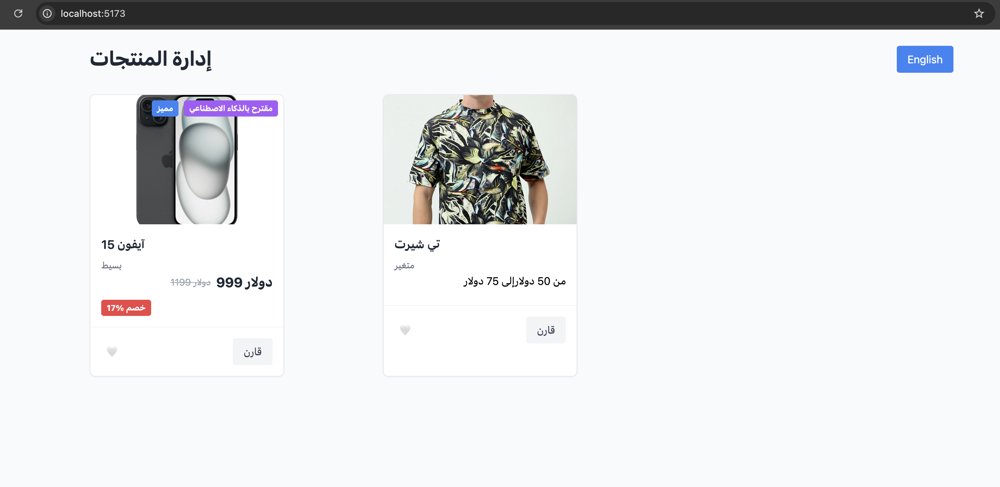

# 🛍️ Product Card UI - React + Vite

This project is a Product Card UI component built using **React + Vite**, supporting:
- 💬 English / Arabic localization
- 🧠 AI Suggested Badge
- 🌟 Featured Badge
- ❤️ Wishlist toggle
- 🔁 Compare (max 3)
- 💸 Variable & Simple product pricing
- 📱 Fully responsive with TailwindCSS
- 🔄 RTL support for Arabic

---

## 📁 Folder Structure

src/
├── components/
│   └── ProductCard.jsx
├── context/
│   └── LanguageContext.jsx
├── stores/
│   └── useCompareStore.js
├── i18n/
│   ├── en.json
│   └── ar.json
├── App.jsx
├── main.jsx
├── index.css


---

## ⚙️ Setup & Run

```bash
# Install dependencies
npm install

# Start the development server
npm run dev


### 🌐 Notes on Localization Logic

- Translations are stored in `src/i18n/en.json` and `src/i18n/ar.json`.
- The `LanguageContext` manages the current language and provides a toggle function.
- All text is dynamically loaded based on the selected language using `useLanguage()`.
- When Arabic is selected:
  - The `<html>` or root container uses `dir="rtl"` for proper layout.
  - RTL-specific classes and styles are applied automatically.
- Language toggle button switches between Arabic and English in real time without page reload.

## 📸 Preview

Here is a preview of the Product Card UI:




